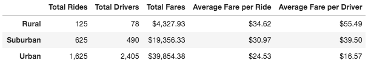
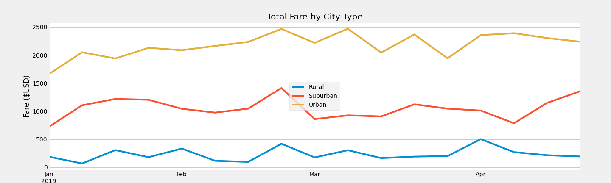

# PyBer Analysis

## Overview 

The following is an analysis of transaction data for the ride-share company PyBer. Data from a total of 2,375 rides was categorized by whether the transaction occured in a rural, suburban, or urban city. This new analysis builds upon previous knowledge gained through an analysis of the measures of central tendencies of data by city type and the percent of total fares, total rides, and total drivers by city type. 

## Results: 

### City Type Data Summary 
The total number of rides, total number of drivers, total fares, average ride per fare, and average fare per driver for each of the three city types (Rural, Suburban, and Urban) are shown in the chart below: 

It can be seen that the majority of rides (1,625) and the largest total fares ($39,854.38) occurred in urban settings, where there are also many more drivers (2,405). Indeed, urban cities was the only city type in which the total number of drivers exceeded the total number of rides. Suburban cities saw the second highest number of rides (625), total fares ($19,356.33), and number of drivers (490), with rural cities having significantly lower numbers across all categories (125 rides, $4,327.93 total fares, 78 drivers). When it comes to the average fare per ride and average fare per driver, the opposite is true: average fare per ride and driver were lowest in urban cities ($24.53 and $16.57, respectively) and highest in rural cities ($34.62 and $55.49). Average fare per ride driver was higher than average fare per ride for all city types except for urban cities, where the opposite was true.

### Total Weekly Fares by City Type
When weekly ride fares are analyzed by city type specifically from Jan-April of 2019 (displayed below), it is shown that total ride fares generally followed the same patterns from week to week, with fares peaking at the end of February for all city types. When closely examined some weeks are shown to be exceptions, especially at the start of January and end of April. It can also be seen that there are no weeks in which rural fares exceeded suburban or urban fares, and similarly there are no weeks in which suburban fares exceeded urban fares. 

## Summary: 

Based on the above results, it can be recommended that resources should be spent to increase ridership in rural and suburban areas. This can include targeted advertising or providing incentives to riders by lowering fares, which are higher per ride than urban cities. As rural and suburban ridership increases it then be wise to in turn increase the total number of drivers in these areas by offering sign-on bonuses or other incentives for people to become PyBer drivers. As the average fare per driver is highest in rural and suburban areas, there may be room to do so. Conversely, there may be room to slightly increase the average fare per ride in urban cities, boosting the total fares from urban cities even more and allowing the average fare per driver to increase as well. Another way to address this disparity would be to increase the total number of drivers by offering sign-on bonuses or other incentives for people to become PyBer drivers in rural and suburban cities.

It may also be useful to in the future count total drivers differently, as currently it seems that there are either many drivers that do not contribute to the ride count or that are being double counted between cities of the same type, resulting in anomalies such as there being near 800 more drivers than rides in urban cities, and each driver accounting for less than two rides each for rural and suburban cities. Eliminating non-contributing drivers or conducting analyses by driver id could provide valuable insights in future analyses. 
